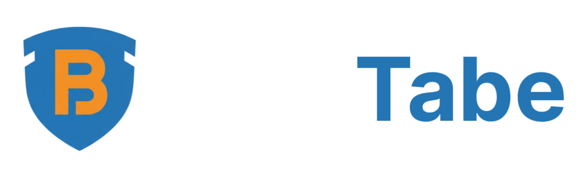

# BlueTape

Compliance made easy for small construction contractors.

## What is BlueTape?
BlueTape helps contractors stay compliant without the headache. It keeps track of permits and licenses, sends smart reminders before anything expires, and gives you a clean, simple view of what needs attention—so you avoid fines and keep projects moving.

## Who it’s for
- Electricians, plumbers, builders, and small construction teams
- Owners who wear many hats and want fewer surprises
- Anyone tired of spreadsheets, sticky notes, and last‑minute scrambles

## What you’ll find on the site
- A clear story of the problem contractors face and how BlueTape fixes it
- A friendly “How it Works” walkthrough
- A simple “Dashboard Preview” that shows the calm, organized view you’ll get
- Real-world testimonials from contractors
- Straightforward pricing
- An Early Access Waitlist for those who want in first

## Why contractors love it
- Avoid expensive fines and stop‑work orders
- Never miss a renewal deadline again
- Save time every month and focus on the job, not the paperwork

## Highlights at a glance
- Automatic tracking of permits and licenses
- Smart reminders at 90/30/7 days
- Clean, easy‑to‑read dashboard
- Built specifically for small contractors

## A quick look

Hero section sets the tone with a bold promise: stop losing money to compliance fines. The page flows into the problem, the solution, a quick preview of the dashboard cards, happy customers, and pricing. It ends with a friendly invite to join the Early Access waitlist.

## Join the Early Access list
Want first access and special launch pricing? Join the waitlist on the website and help shape BlueTape with your feedback.

— The BlueTape Team
